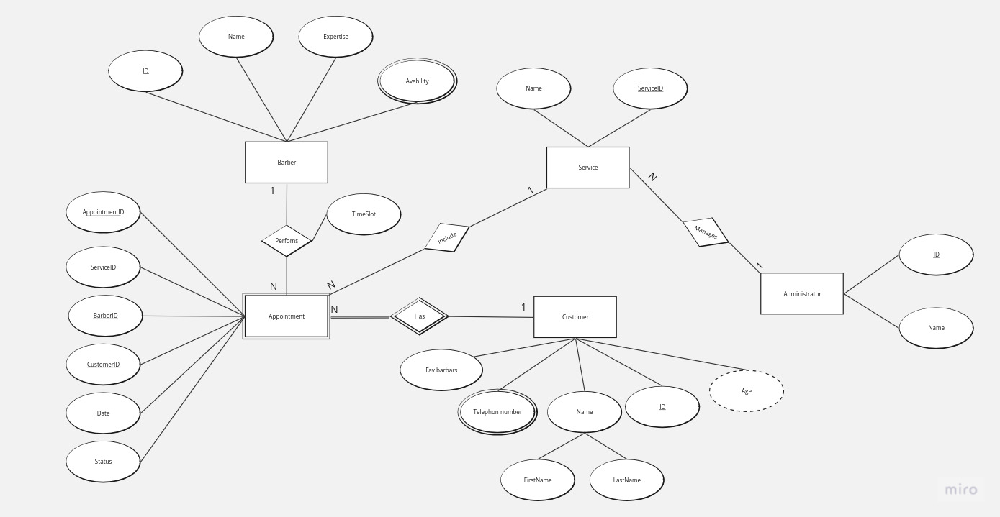
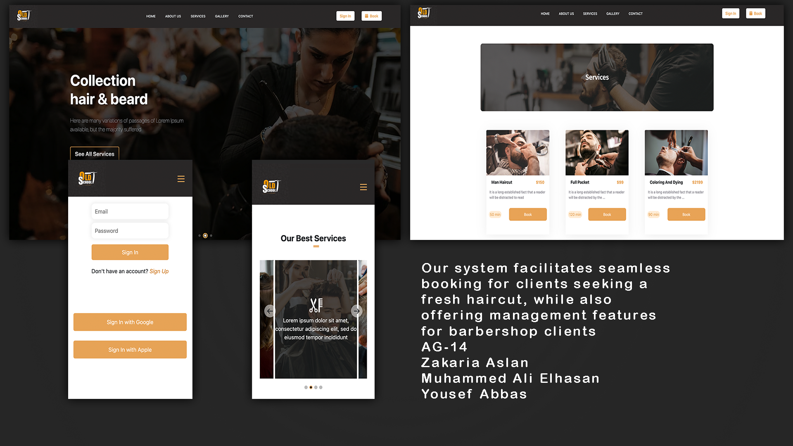

### Purpose

The BarberShop Web Application's goal is to provide an effective and user-friendly platform for both consumers and barbers to manage and plan appointments, hence improving the whole experience of scheduling and getting barber services. The system will consist of both backend and frontend components that work seamlessly together to meet the following requirements: 
 1. Allow customers to simply browse available time slots and barber services.
 2. Set up a notification system to send clients and barbers appointment confirmations, reminders, and updates via email or SMS.
 3. Provide the business owner with an admin dashboard to manage barbers, services, and appointments.
 4. Allow consumers to choose certain services, such as haircuts, shaves, styling, and so on, and tailor their appointments by selecting preferred barbers and time slots. 
 5. Allow consumers to leave evaluations and ratings for barbers from whom they have gotten services.

    
## Project Structure

| File        | Purpose           | What you do?  |
| ------------- | ------------- | ----- |
| `server/` | Backend server code | All your server code |
| [server/README.md](server/README.md) | Everything about the server | **READ ME** carefully! |
| `client/` | Frontend client code | All your client code |
| [client/README.md](client/README.md) | Everything about the client | **READ ME** carefully! |
| [docs/DEPLOYMENT.md](docs/DEPLOYMENT.md) | Free online production deployment | Deploy your app online in production mode |
| [docs/LOCAL_DEPLOYMENT.md](docs/LOCAL_DEPLOYMENT.md) | Local production deployment | Deploy your app local in production mode |

## Requirements

The version numbers in brackets indicate the tested versions but feel free to use more recent versions.
You can also use alternative tools if you know how to configure them (e.g., Firefox instead of Chrome).

* [Git](https://git-scm.com/) (v2) => [installation instructions](https://www.atlassian.com/git/tutorials/install-git)
  * [Add your Git username and set your email](https://docs.gitlab.com/ce/gitlab-basics/start-using-git.html#add-your-git-username-and-set-your-email)
    * `git config --global user.name "YOUR_USERNAME"` => check `git config --global user.name`
    * `git config --global user.email "email@example.com"` => check `git config --global user.email`
  * > **Windows users**: We recommend to use the [Git Bash](https://www.atlassian.com/git/tutorials/git-bash) shell from your Git installation or the Bash shell from the [Windows Subsystem for Linux](https://docs.microsoft.com/en-us/windows/wsl/install-win10) to run all shell commands for this project.
* [Chalmers GitLab](https://git.chalmers.se/) => Login with your **Chalmers CID** choosing "Sign in with" **Chalmers Login**. (contact [support@chalmers.se](mailto:support@chalmers.se) if you don't have one)
  * DIT342 course group: https://git.chalmers.se/courses/dit342
  * [Setup SSH key with Gitlab](https://docs.gitlab.com/ee/ssh/)
    * Create an SSH key pair `ssh-keygen -t ed25519 -C "email@example.com"` (skip if you already have one)
    * Add your public SSH key to your Gitlab profile under https://git.chalmers.se/profile/keys
    * Make sure the email you use to commit is registered under https://git.chalmers.se/profile/emails
  * Checkout the [Backend-Frontend](https://git.chalmers.se/courses/dit342/group-00-web) template `git clone git@git.chalmers.se:courses/dit342/group-00-web.git`
* [Server Requirements](./server/README.md#Requirements)
* [Client Requirements](./client/README.md#Requirements)

## Getting started

```bash
# Clone repository
git clone git@github.com:aslanSolutions/Old-School-Shop.git


# Setup backend
cd server && npm install
npm run dev

# Setup frontend
cd client && npm install
npm run serve
```

> Check out the detailed instructions for [backend](./server/README.md) and [frontend](./client/README.md).

## Visual Studio Code (VSCode)

Open the `server` and `client` in separate VSCode workspaces or open the combined [backend-frontend.code-workspace](./backend-frontend.code-workspace). Otherwise, workspace-specific settings don't work properly.

## System Definition (MS0)

### Pages

* Home: This section comprises a significant portion of the website, including features like the "Contact Us" section, information about us, and a gallery showcasing our salon.
* Booking page: This is where customers can reserve their appointment time.
* Barber dashboard: Barbers can set their availability and view the list of scheduled appointments from their dashboard.
* Admin page: The admin can create a list of services for customers to choose from and handle inquiries.
* Team page: Here, customers can get to know the members of our skilled barber team.

Note: We still have upcoming pages and requirements 

### Entity-Relationship (ER) Diagram



## Teaser (MS3)


